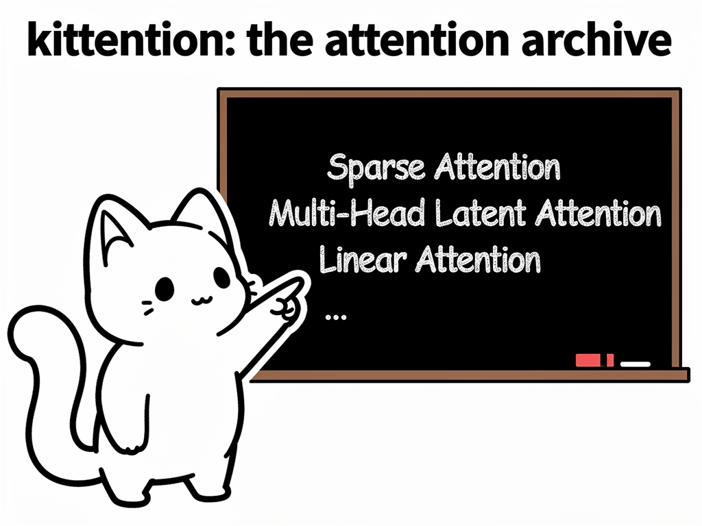

# kittention
kittention: the attention archive

## Overview

**kittention** is a modular collection for different **attention mechanisms** implemented in numpy.  
The is just a fun side project.

---

## Features

- Unified implementation interface for various attention types  
- Will contain all attention types starting from 2014

---

## Attention Types

Implementation status:

## Attention Types

| Attention Mechanism | Paper | Status |
|--------------------|-------|--------|
| Self Attention (Baseline) | https://arxiv.org/abs/1706.03762 | ✅ |
| Sparse Attention | https://arxiv.org/abs/1904.10509 | ✅ |
| Grouped Query Attention | https://arxiv.org/abs/2305.13245 | ✅ |
| Linear Attention | (tba) | ⏳ |
| Multi-Head Latent Attention | https://arxiv.org/abs/2405.04434 | ⏳ |
| Sparse Sinkhorn Attention | https://arxiv.org/pdf/2002.11296 | ✅ |
| Spark Attention | https://arxiv.org/pdf/2506.06644 | ✅ |
| SeedFold Linear Attention 🧬| https://arxiv.org/abs/2512.24354 | ⏳ |

---
